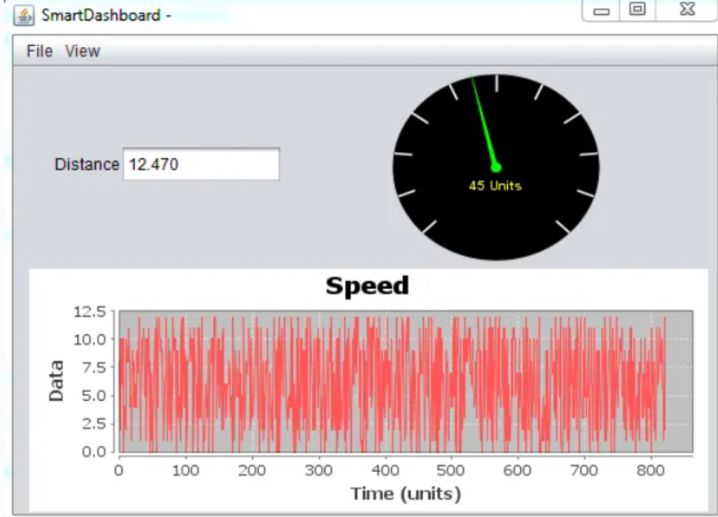
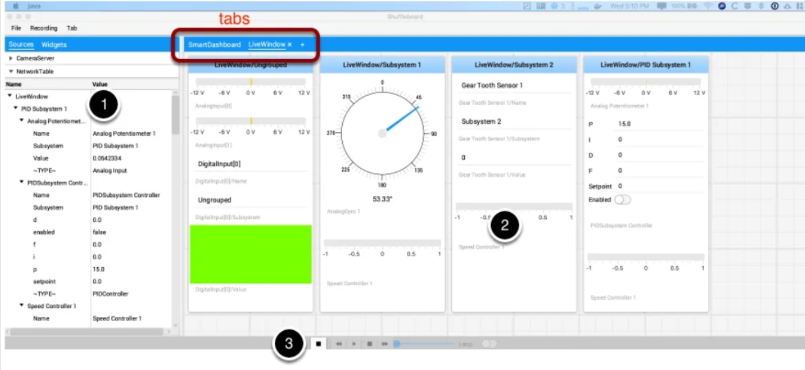
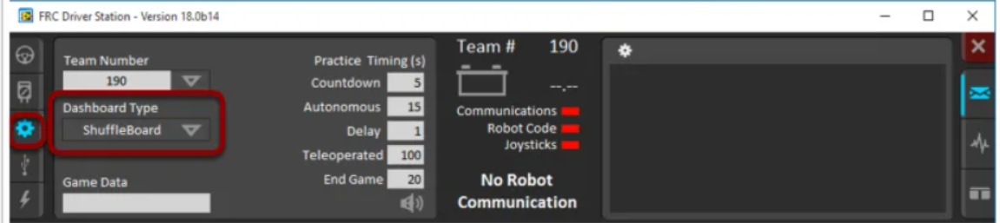

# Project 3_1: Shuffleboard and Smart Dashboard 
This project will have you do the same as [Project 3_0](https://classroom.github.com/a/J7wVph9D) with printing out joystick values but onto the SmartDashboard instead.

***Pre-req:***
- All the pre-reqs of previous projects
- You can use the same WPILib robot project you created in [Project 3_0](https://classroom.github.com/a/J7wVph9D)

## ***Smart Dashboard***
### What is the Smart Dashboard? ###

The Smart Dashboard is a dashboard that appears as an option on the *driverstation laptop*. You can use this to layout debugging information and other important information regarding the state of your robot in real time (updates as the robot runs).

## ***Shuffleboard***
### What is the Shuffleboard? ###

The Shuffleboard is another dashboard that appears as an option on the *driverstation laptop*.  It much nicer graphical widgets, sliders, etc. So it is much easier to read than the default interface of the ***Smart Dashboard***. It also has many more features outlined [here]() that the Smart Dashboard doesn't have. 

## ***How to select which dashboard to use***
Typically, the Shuffleboard is always the one we use. It is a lot easier to move widgets around, look at numbers and graphs, and overall easier to use and understand.

To select your dashboard type. Simply open up the *driverstation app*, go to the gear icon, and select `Dashboard Type` to be `Shuffleboard`. 

Note: Shuffleboard and SmartDashboard should come pre-installed along with your WPiLib suite installation. If you do not have these showing up as options, please double check that you did your installation correctly. 

## ***Using Shuffleboard***
### Using SmartDashboard Directly
To print data to your Shuffleboard, you will can directly use the `SmartDashboard` object in your code. Though that may sound contradictory, but because you are using Shuffleboard as your selected dashboard. All the data printed in your code will be displayed on the Shuffleboard. 

You will not have to construct the `SmartDashboard` object. This is because there is only *one instance* of the object. All you have to do is import and use it. 

The SmartDashboard has methods for putting numbers, booleans, Strings. But they all have the same parameters:
- First parameter --> "Key" or the name of the data. This will appear as the title for the widget. This can also be used to reference the data just like a hashmap to get updated data from the Shuffleboard if the driverstation user changed the data. 
- Second parameter --> the double, boolean, or string value that the widget will display

*Example:*
`SmartDashboard.putNumber("Robot Rotation", getHeading());`

In this case from our [2022 BB8 Code](https://github.com/MillenniumFalcons/2022-RapidReact-BB8/blob/main/src/main/java/team3647/frc2022/subsystems/SwerveDrive.java#L112), `getHeading()` returns a double that represents the heading of the robot, which is being updated constantly. 

Remember that the value you are passing in must be a value that's getting periodically updated. Otherwise, you will end up with a non-changing value in your Shuffleboard. **Thus, this way of printing directly using the `SmartDashboard` is typically used in PeriodicSubsystem files to directly access the periodically upated data**

### Using Team 3647 GroupPrinter
This is a more convient way to periodically print the values returned by periodic functions. This object is a wrapper around the `SmartDashboard` class and uses `SmartDashboard` to print values of periodic functions instead of just doubles.

This class, just like `SmartDashboard` only has one instance. So to use this class, you must first get the instance of `GroupPrinter`.

*Example:*
`private final GroupPrinter m_printer = GroupPrinter.getInstance();`

Just like the `SmartDashboard` object, this has methods for printing all sorts of data types from doubles to strings. But they all have the same parameters:
- First parameter --> the "Key" that will appear on your widget. 
- Secont parameter --> the function (DoubleSupplier, BooleanSupplier, etc. objects) that supplies the value that's going into your widget.

*Example*
`m_printer.addBoolean("Ready to Shoot", () -> m_superstructure.readyToAutoShoot());`

In this case from our [2022 BB8 Code](https://github.com/MillenniumFalcons/2022-RapidReact-BB8/blob/main/src/main/java/team3647/frc2022/robot/RobotContainer.java#L180), `() -> m_superstructure.readyToAutoShoot` is a lambda that references the function from `m_superstructure`. This is the `BooleanSupplier` that "Supplies" the boolean that represents if the robot is ready to shoot or not to `m_printer` to print perioidcally. 

*Alternatively, this can be also written as*:
`m_printer.addBoolean("Ready to Shoot", m_superstructure::readyToAutoShoot;`

Both of these ways of writing references to functions are treated as Suppliers. 

Remember, lambda references to functions serve as Suppliers. You can use this to get periodically updated values within subsystems. **Thus, this way of printing using `GroupPrinter` is typically used inside RobotContainer to reference subsystems' functions**

## ***Robot Code Requirements***

- Create [`XboxController`](https://docs.wpilib.org/en/stable/docs/software/basic-programming/joystick.html?highlight=xboxcontroller#xboxcontroller-class) object called `mainController` in RobotContainer.java
	- [More](https://github.com/MillenniumFalcons/2022-RapidReact/blob/main/src/main/java/team3647/lib/inputs/Joysticks.java) on how to use XboxController
- Use `::` to refer to the joystick value that is constantly updated
- Put the value of `mainContoller` in real time with `GroupPrinter` on to the SmartDashboard. 

## ***Authors***
- [Team 3647, Edward Sun](https://github.com/EdwardoSunny)

